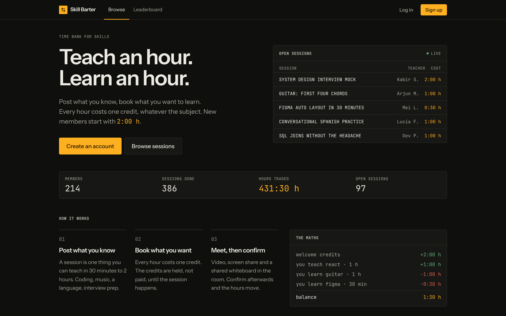

<div align="center">

# Skill Barter

**Trade what you know for what you want to learn.**

Teach someone for an hour, earn an hour. Spend it learning from someone else.
No money, no subscriptions. Every session runs in the app: video, screen share, a shared whiteboard and chat.

[**Live app**](https://skillbarter-web.vercel.app) · [Product](docs/PRODUCT.md) · [PRD](docs/PRD.md) · [Technical reference](docs/TECHNICAL.md) · [Deploy guide](docs/DEPLOYMENT.md)

[](https://render.com/deploy?repo=https://github.com/Priyansh10ff/SkillBarter)
&nbsp;
[](https://vercel.com/new/clone?repository-url=https%3A%2F%2Fgithub.com%2FPriyansh10ff%2FSkillBarter&root-directory=client&env=VITE_SERVER_URL&envDescription=URL%20of%20the%20Skill%20Barter%20API%20on%20Render)


<!-- Screenshots: save them to docs/screenshots/ and uncomment.

-->

</div>

---

## What it is

Skill Barter is a peer-to-peer skill exchange built on time credits. You post something you can teach, someone books a session with you, and when it's done you earn credits. You spend those credits to book sessions with other people. Every hour is worth the same, whether it's calculus, guitar or Figma.

Every new member starts with **2 credits**, so they can learn before they have taught anything.

The hard part is keeping the credits honest. Every movement is an entry in an append-only ledger. Credits are **held** when a session is booked and only **released** to the teacher once the learner confirms it, 48 hours after the session if they never respond, or after an admin reviews a reported problem.

## Features

| | |
|---|---|
| **Accounts** | Email and password sign-up that logs you straight in, a 3-step onboarding (teach, learn, availability), public profiles with ratings, reviews, badges and session stats. |
| **Listings** | Post a session (30, 60, 90 or 120 minutes, 1 credit per hour) with a category and tags. Full-text search, category filter, pagination. |
| **Matching** | Suggested sessions based on what you want to learn, and **barter matches**: people who teach what you want *and* want what you teach. |
| **Bookings** | Credits are held on booking. Either side proposes a time and the other accepts. Each booking has its own chat. Cancel before the start for a full refund. |
| **Session room** | 1:1 video and audio, screen share, a shared live whiteboard and chat. Only the two participants can join, from 15 minutes before the start to 3 hours after the end. |
| **Settlement** | The learner confirms and the teacher is paid. If nobody responds, credits release automatically after 48 hours. Reporting a problem freezes the credits until an admin decides. |
| **Wallet** | Balance, credits held in open bookings, a balance chart and the full ledger history. |
| **Community** | 1 to 5 star reviews from both sides, milestone badges, and a leaderboard by sessions taught or by rating. |
| **Real-time** | Live notifications, balance updates and booking changes over Socket.IO. |
| **Design** | A dark, terminal-inspired interface. Amber is used for credits and time and nothing else. Meets WCAG AA contrast, has visible focus, respects reduced motion. |

## How a session works

```
 book ──► PENDING ──(propose ⇄ accept)──► SCHEDULED ──► session room ──► COMPLETED
  │          │                                │                             ▲
  │ hold     └─ cancel / decline ─► CANCELLED │ report a problem            │ release
  │ credits     (refund)                      └──────► DISPUTED ── admin ───┘ or refund
```

1. **Book.** The listing's cost moves out of the learner's balance and is held against the booking.
2. **Schedule.** Either side proposes a time. Only the other person can accept it.
3. **Meet.** The room opens 15 minutes before the start. Video goes directly between the two browsers.
4. **Settle.** The learner confirms, or the credits release on their own 48 hours after the end. A reported problem freezes them for an admin.
5. **Review.** Both sides rate each other, and badges and leaderboards update.

Each step is a single MongoDB transaction that updates the booking, the balance and the ledger together, and each status change is a conditional update. A double click or two requests racing can never pay or refund twice. The details are in [TECHNICAL.md › Credits and bookings](docs/TECHNICAL.md#5-credits-and-booking-lifecycle).

## Tech stack

| Layer | Choice |
|---|---|
| Frontend | React 19, Vite 5, Tailwind CSS 3, React Router 7, Axios |
| Real-time | Socket.IO 4 (notifications, presence, whiteboard) |
| Video | WebRTC via PeerJS, with a self-hosted PeerServer on the API |
| Backend | Node.js 22, Express 5, zod validation, node-cron |
| Database | MongoDB Atlas (replica set) with Mongoose 9 and multi-document transactions |
| Auth | JWT bearer tokens, bcrypt |
| Tests | `node:test`, supertest, mongodb-memory-server (replica set), socket.io-client |
| Hosting | Vercel (client), Render (API), MongoDB Atlas (database) |

## Getting started

### Prerequisites

- Node.js **22** or newer
- A MongoDB **replica set**. A free [Atlas M0](https://www.mongodb.com/atlas) cluster works. A standalone local `mongod` won't, because credit movements need transactions.

### Run locally

```bash
git clone https://github.com/Priyansh10ff/SkillBarter.git
cd SkillBarter

# API → http://localhost:5000
cd server
cp .env.example .env        # set MONGO_URI and JWT_SECRET
npm install
npm run seed                # optional: 6 demo members with listings, sessions and reviews
npm run dev

# Web app → http://localhost:5173 (second terminal)
cd client
npm install                 # .env.development already points at :5000
npm run dev
```

Demo accounts from the seed are `asha@example.com`, `arjun@example.com`, `mei@example.com`, `lucia@example.com`, `kabir@example.com` and `sara@example.com`. They all use the password `password123`.

To try a session room on your own, log in as the learner and the teacher in two different browsers (or a normal and a private window).

### Scripts

| Where | Command | Does |
|---|---|---|
| `server/` | `npm run dev` | API with auto-reload |
| `server/` | `npm test` | Full API test suite on an in-memory replica set |
| `server/` | `npm run seed` | Demo data through the real services (`-- --reset` wipes first) |
| `server/` | `npm run make-admin -- you@example.com` | Gives an account the admin role (resolves reported problems) |
| `server/` | `npm run reset` | Empties every collection |
| `client/` | `npm run dev` / `build` / `lint` / `preview` | Vite dev server, production build, ESLint, preview the build |

`seed` and `reset` refuse to run when `NODE_ENV=production`.

## Environment variables

**`server/.env`**

| Key | Required | Example | Purpose |
|---|---|---|---|
| `MONGO_URI` | ✓ | `mongodb+srv://…/skillbarter` | Atlas connection string |
| `JWT_SECRET` | ✓ | 64+ random hex chars | Signs login tokens and room peer IDs (at least 16 characters) |
| `CLIENT_URL` | prod | `https://skillbarter-web.vercel.app` | The only origin allowed by CORS and sockets in production |
| `NODE_ENV` | | `development` | `production` on Render |
| `PORT` | | `5000` | Set by Render automatically |
| `JWT_EXPIRES_IN` | | `7d` | Session length |
| `TURN_URL` / `TURN_USERNAME` / `TURN_CREDENTIAL` | | | Optional TURN relay for video on strict networks |
| `DNS_SERVERS` | | `1.1.1.1,8.8.8.8` | Local fix for `querySrv ECONNREFUSED` on some networks |

**`client/.env`**

| Key | Example | Purpose |
|---|---|---|
| `VITE_SERVER_URL` | `https://skillbarter-ppj7.onrender.com` | The API, used for REST, Socket.IO and PeerJS. Baked in at build time |

The server checks its environment at startup and exits with a clear message if something is missing or malformed.

## Project structure

```
SkillBarter/
├── client/          React SPA (Vercel)
│   └── src/
│       ├── pages/        One file per route
│       ├── components/   ui/ primitives, layout/, listings/, bookings/, room/, wallet/, landing/
│       ├── context/      Auth, socket, notifications, confirm dialog
│       └── lib/          Config, formatting, constants
├── server/          Express API + Socket.IO + PeerServer (Render)
│   ├── services/         Business logic: credits, bookings, rooms, reviews, badges, matches
│   ├── routes/ controllers/ validators/ middleware/ models/
│   ├── sockets/          Socket auth and session-room events
│   ├── jobs/             Auto-release cron
│   ├── scripts/          seed, make-admin, reset
│   └── tests/            node:test suites
├── docs/            Product, PRD, technical, design and deployment docs
└── render.yaml      Render blueprint for the API
```

The full tree with what each file does is in [TECHNICAL.md › Repository structure](docs/TECHNICAL.md#3-repository-structure).

## Testing

```bash
cd server && npm test
```

The API suite runs against an in-memory MongoDB **replica set**, so transactions behave the way they do on Atlas. After every booking test it checks the ledger invariants: each user's ledger entries add up to their balance, no balance is ever negative, and total balances plus credits held equals everything ever granted. Concurrency tests fire parallel book, complete and cancel requests and check that credits move exactly once.

For the client, `npm run lint` and `npm run build` must both pass.

## Deployment

The API runs on Render (blueprint in `render.yaml`, health check `/health`), the client on Vercel (root `client`), and the data on MongoDB Atlas. Two settings connect them:

| Where | Setting | Value |
|---|---|---|
| Vercel | `VITE_SERVER_URL` | the Render URL |
| Render | `CLIENT_URL` | the Vercel URL |

The step-by-step guide, smoke test and troubleshooting are in [docs/DEPLOYMENT.md](docs/DEPLOYMENT.md).

## Documentation

| Doc | What's in it |
|---|---|
| [PRODUCT.md](docs/PRODUCT.md) | Why it exists, who it's for, how it works, principles |
| [PRD.md](docs/PRD.md) | Goals, personas, user stories with acceptance criteria, requirements, metrics, roadmap, risks |
| [TECHNICAL.md](docs/TECHNICAL.md) | Architecture, data model, credit ledger and booking state machine, REST API, socket events, video room, security |
| [DESIGN.md](docs/DESIGN.md) | Design tokens, type, components and the accent rule |
| [DEPLOYMENT.md](docs/DEPLOYMENT.md) | Atlas → Render → Vercel, smoke test, troubleshooting, rollback |
| [CONTRIBUTING.md](CONTRIBUTING.md) | Local setup, conventions, commit style, PR checklist |
| [SECURITY.md](SECURITY.md) | How to report a vulnerability, and the security model |

## Known limitations

- **No email.** There is no email verification, no password reset and no email notifications. Render's free tier blocks outbound SMTP.
- **Disputes have no admin screen yet.** Admins resolve them through the API (`/api/admin/disputes`).
- **Runs on a single instance.** Whiteboard strokes are kept in memory and Socket.IO has no Redis adapter.
- **Free-tier cold starts.** The first request after about 15 idle minutes takes 30 to 50 seconds.

The full list and planned fixes are in [TECHNICAL.md › Known limitations](docs/TECHNICAL.md#13-known-limitations) and the [PRD roadmap](docs/PRD.md#9-release-plan).

## Author

Built by [Priyansh Dugar](https://github.com/Priyansh10ff) · [LinkedIn](https://www.linkedin.com/in/priyansh-dugar-709333363/) · [X](https://x.com/_Priyansh_10)
